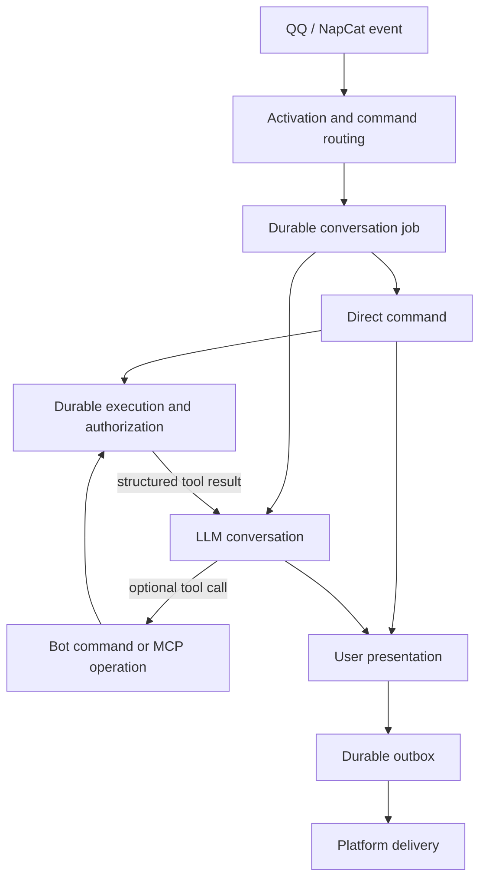

# Bot architecture

Bot separates inbound work, model conversation, business execution and outbound
transport. They share identifiers, not state machines or interchangeable text.

## Ownership

| Layer | Code | Responsibility |
| --- | --- | --- |
| Platform adapters | `internal/qqbot`, `internal/napcat`, `internal/message` | Actor, conversation, platform IDs, source time, receive time, attachment references and replies |
| Routing | `internal/routing` | Whether to respond and whether the accepted input is a command or an Agent turn |
| Coordinator | `internal/botapp` | FIFO jobs, leases, login and confirmation waits, atomic output commit |
| Business commands | `internal/commands`, `internal/life` | Canonical arguments, validation, domain data, privacy, effects and presentation |
| Model runtime | `internal/agent`, `internal/mcp`, `internal/toolresult` | Tool descriptions, optional discovery, model requests, JSON results and checkpoints |
| Persistence | `internal/store` | Jobs, exact conversation events, operation records, credentials and outbox |
| Delivery | `internal/delivery`, platform adapters | Send already-produced output and record platform acceptance |

Feature code does not depend on QQ or NapCat. Rendering does not execute
business operations. Delivery does not call the model or rerun commands.

## Inbound jobs are not model history

There is no separate inbox table. `conversation_jobs` stores the accepted
inbound envelope, the routing decision and the normalized invocation. A source
event ID makes admission idempotent. Unaddressed ambient group messages are
ignored before job persistence.

An actor identifies the user who made the request. A conversation identifies
where replies go. Group members can share a public conversation but never an
OAuth identity. Display names are presentation, not authorization.

A job moves through `queued`, `running`, `waiting_auth`,
`waiting_confirmation`, `retry_wait` and a terminal state. Every execution and
checkpoint write is fenced by the current job revision and lease. A stale
worker cannot finish a resumed job or execute an operation under a newer lease.

Confirmation replies are control input when a concrete operation is waiting.
They update that operation and requeue the original job. They are not new LLM
user turns, and the model cannot approve an operation by writing a flag.

## Model conversation

The model context consists of a persisted historical summary, when one exists,
followed by exact role-bearing `conversation_events` after its coverage boundary.
Jobs, interaction logs, usage rows and the delivery outbox are not read as a chat
transcript. A summary is historical information, never a new user instruction,
an approval, or a fresh tool observation.

History is paged by event ID instead of capped at 80 messages. Retained messages
are replayed unchanged so ordinary follow-ups keep a stable cacheable prefix.
Compaction triggers at 96,000 estimated tokens, counting history, instructions
and tool schemas within the 128,000-token request window. The remaining capacity
provides room for estimation overhead and completion.
Near capacity, older history is semantically summarized; recent complete turns
and their assistant/tool pairs remain exact. The summary and its coverage
boundary are persisted together, and ordinary turns reuse them unchanged.
Original events remain stored. A failed summary must not advance the boundary
or silently discard history.
Eino's summarization middleware processes bounded prefixes of complete durable
turns, aiming to retain about 32,000 tokens of recent history. Internal event-ID
metadata identifies the covered prefix without entering provider requests.
The in-flight state remains authoritative: compaction preserves system messages
and all recent messages, including tool results not yet persisted by the event
consumer. An oversized current turn fails explicitly instead of being dropped.
Summary calls use the existing provider transport, deadline and usage budget.
Subscription mutations return facts about their targets and counts rather than
embedding the user's entire subscription list; that list is queried separately.

| Origin | Model representation |
| --- | --- |
| Accepted user input | User event with actor, original time and supported image parts |
| Model answer or tool call | Assistant event preserving text, tool name, arguments and call ID |
| Tool success, error or denial | Tool event containing the shared JSON result |
| Direct command | Real user event and an assistant event marked as command-origin JSON; no invented tool call |
| Login instructions, confirmation prompts, receipts | Host output only; the eventual tool outcome explains what happened |
| Notifications and platform events | Delivery/control only, unless the user explicitly refers to relevant content |

Historical time is stable: source time, receive time, model generation time,
operation observation time and platform acceptance time have distinct meanings.
History formatting does not relabel an old message with the current clock.
Business timestamps in returned data remain unchanged.

A reply reference is resolved only against an accepted Bot message in the same
conversation. Its `ResponseContext` carries the public command and arguments
for deterministic follow-ups such as “周日呢”. Quoted text is explicitly
identified as historical context, not a new tool result or fresh observation.

Summaries retain user goals and constraints, speaker identities and times,
exact business identifiers, observed execution outcomes and unfinished work.
Typed roles in recent history remain intact; host approval messages are not
manufactured into assistant or user evidence. Unsupported assistant image
modalities are not replayed to a provider that cannot encode them.

## One execution, two outputs

A command records its already-fetched domain value in `Response.Data` before
formatting a table, sentence or image. It does not parse rendered text back into
data and does not make a second network call to build model context.

- User output: `Response.Text`, image and response parts.
- Model output: the `internal/toolresult` JSON envelope around domain data.

Bot commands and MCP use the same fields: `source`, `operation`, `status`,
`observed_at`, `result`, and optional `error` with `code` and `message`.
Success is `succeeded`; failures distinguish invalid input, authorization,
denial and an unknown external outcome. An empty domain result remains empty,
not an invented success explanation. Native JSON returned by MCP remains JSON;
a textual MCP result remains a string inside `result`.

A successful operation does not imply successful image rendering or platform
acceptance. The model never receives a false “delivered” claim because output
was merely queued. Operation results survive independently of presentation.

## Commands and discovery

The command descriptor registry owns names, aliases, input normalization,
validation, effect, audience, examples and help. User help and the model's
complete command manual are generated from that registry.

The model uses `run_bot_command` with a full user command. It may optionally
use `search_bot_commands`, which returns multiple ranked candidates. MCP
`search_campus_tools` exposes exact server names, schemas, descriptions and
effects, and `call_campus_tool` executes a published name. Resource and prompt
tools provide schema and planning context. MCP setup remains lazy: normal
conversation and Bot commands do not require a working MCP connection.

There is no host rule requiring a tool call, a successful search, or an empty
Bot search before using MCP. A model answer is not discarded to force another
provider request. Tool failures are returned as evidence when recoverable.

Search covers names, descriptions, aliases, parameter fields and examples.
Location aliases normalize to canonical values before execution. Fuzzy search
is not group activation and never selects a destructive target without exact
validated arguments.

User help emphasizes campus queries, personal work, accounts and notifications.
Internal system/health commands are not a user feature. Technical MCP inventory
is shown when explicitly requested; ordinary capability questions receive
user-facing help.

## Authorization and confirmation

All published MCP operations are available in private conversations within the
caller's actual server permissions. A caller with no login can discover and
query public MCP data. Failure of an existing grant is reported as an auth or
service failure, never silently substituted with another user's identity.

Read and ordinary write operations execute without an additional confirmation.
Dangerous operations, and operations whose risk cannot be established, require
user confirmation whether selected by a direct command or by the model.
Confirmation is bound to the saved operation and exact arguments. Todo and
homework targets are resolved to exact IDs before preparation, so list
reordering cannot change a pending operation; ambiguous titles are rejected. GraphQL's
`confirmed` marker is set by the approved execution path, never trusted from
model arguments.

Each independently reversible mutation has a durable execution row. Preparation
is followed by a lease claim before external effects. Terminal outcomes are
`succeeded`, `failed`, `unknown`, `denied`, `cancelled` or `expired`. An
interrupted write that may have reached the server becomes `unknown` and is
never automatically replayed. Read recovery may safely query again.

Group execution remains limited to public Bot capabilities. Personal data and
MCP sessions are private. Asking how a command works is distinct from actually
reading personal data. Bare question marks and unknown slash words do not
activate an unaddressed group conversation. Explicit commands, mentions and
verified replies retain their intended activation rules.

## Reliability and outbox

`outgoing_messages` contains immutable, delivery-ready output, reply routing,
platform receipts and delivery state. Final job state, pending outputs and
operation receipt state are committed atomically. A delivery retry only sends
that output; it cannot repeat a capability or an LLM turn.

Platform acceptance means the platform accepted a message, not that a human
read it. Ambiguous sends and workers lost during sending become `unknown` and
are not blindly resent. Definite transient failures use bounded delivery retry.
Terminal attachment bytes are pruned; pending/retry attachments are retained.
Old terminal outbox rows have a bounded retention period.

QQ Gateway retains session and sequence for RESUME after reconnect. Invalid
sessions clear the resume point. Ordinary failures downloading individual
images do not discard usable text or other images; the model receives a clear
notice about missing inputs. Hard input limits and cancellation still stop work.

The model's per-request context window and run-wide token budget are separate.
One run remains bounded by time, tool calls and physical provider attempts.
Exhausted model transport retries have a distinct `upstream_transport` failure
class and a connection-failure reply. They do not imply a domain API failure
or that earlier business operations were rolled back.
Identical tool calls are not re-executed; a bounded number of structured repeat
refusals lets the model change its plan before the run stops.

## Verification and deployment

Regression coverage must exercise activation, structured domain results,
actor/time replay, dangerous-operation approval and denial, unknown-write
recovery, gateway RESUME and terminal attachment cleanup. Scripted provider
fixtures verify that ordinary answers and direct tool choices are accepted
without mandatory search or semantic retry.

`scripts/deploy-mac.sh` builds one committed revision on the macOS deployment
host, switches binaries and launchd services transactionally, checks health and
rolls back a failed switch. A deployment is verified by the actual
`BOT_BUILD_VERSION` and both service health endpoints, not only by Git state.
