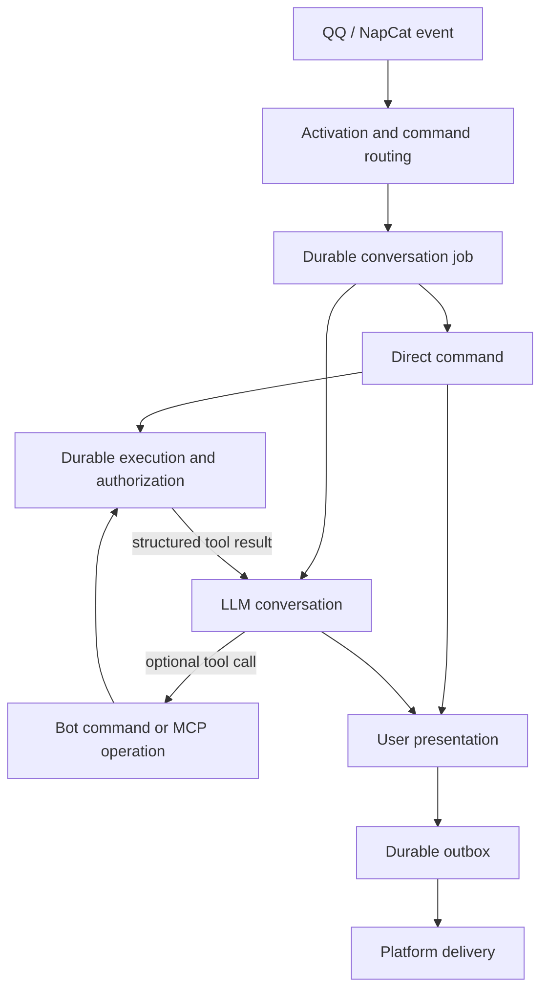

# Bot architecture

Bot separates inbound work, model conversation, business execution and outbound
transport. They share identifiers, not state machines or interchangeable text.

## Ownership

| Layer | Code | Responsibility |
| --- | --- | --- |
| Platform adapters | `internal/qqbot`, `internal/napcat`, `internal/message` | Actor, conversation, platform IDs, source time, receive time, attachment references and replies |
| Routing | `internal/routing` | Whether to respond and whether the accepted input is a command or an Agent turn |
| Coordinator | `internal/botapp` | FIFO jobs, leases, login and confirmation waits, atomic output commit |
| Business commands | `internal/commands`, `internal/life` | Canonical arguments, validation, domain data, privacy, effects and presentation |
| Model runtime | `internal/agent`, `internal/mcp`, `internal/toolresult` | Tool descriptions, optional discovery, model requests, JSON results and checkpoints |
| Persistence | `internal/store` | Jobs, exact conversation events, operation records, credentials and outbox |
| Delivery | `internal/delivery`, platform adapters | Send already-produced output and record platform acceptance |

Feature code does not depend on QQ or NapCat. Rendering does not execute
business operations. Delivery does not call the model or rerun commands.

## Inbound jobs are not model history

There is no separate inbox table. `conversation_jobs` stores the accepted
inbound envelope, the routing decision and the normalized invocation. A source
event ID makes admission idempotent. Unaddressed ambient group messages are
ignored before job persistence.

An actor identifies the user who made the request. A conversation identifies
where replies go. Group members can share a public conversation but never an
OAuth identity. Display names are presentation, not authorization.

A job moves through `queued`, `running`, `waiting_auth`,
`waiting_confirmation`, `retry_wait` and a terminal state. Every execution and
checkpoint write is fenced by the current job revision and lease. A stale
worker cannot finish a resumed job or execute an operation under a newer lease.
Running workers renew their leases and task expiry through heartbeats. The
lease measures worker liveness, not an execution deadline: a healthy long
conversation is not reclaimed or expired because of its elapsed runtime.

Confirmation replies are control input when a concrete operation is waiting.
They update that operation and requeue the original job. They are not new LLM
user turns, and the model cannot approve an operation by writing a flag.

## Media input

Inbound envelopes retain ordered media references and nested forwarded messages.
NapCat expands forwarding references and resolves file IDs on the event worker,
not the websocket reader. QQ reads recursive `msg_elements` and preserves its
nested attachments/authors without copying scene authentication tokens. Original outer text/mentions control routing; text or
mentions inside a forward cannot activate a group command. Forwarded speaker IDs
and original times travel with each nested node. Attachment-only private inputs
activate the agent; ambient group attachments remain ignored.

The model input layer downloads images/stickers through the existing vision
normalizer. Files use Kimi's `/files` upload (`purpose=file-extract`), content
retrieval and temporary-file deletion, using the configured premium Kimi key.
The complete extracted response is user material, including when the endpoint
returns JSON. It never becomes a system instruction or command invocation.
Prepared user events are persisted before model invocation; recovery looks up the
same actor/job event and reuses its text/images without another upload. Raw Inbox
input and delivery records remain separate from this transcript.

Downloads retain the existing 25 MiB per-file media bound. Platform-provided voice
transcripts are labelled as potentially imperfect ASR, not original-audio analysis.
Unsupported audio/video,
missing URLs, expired files and extraction failures receive explicit context
annotations. GIF vision is static-image processing, not full animation analysis.
Nested forwards have a structural recursion guard; ordinary history and media
lists are not repeatedly trimmed. Source requests carry no Kimi credential;
credential-bearing API requests cannot redirect to another origin.

## Model conversation

The model context consists of a persisted historical summary, when one exists,
followed by exact role-bearing `conversation_events` after its coverage boundary.
Jobs, interaction logs, usage rows and the delivery outbox are not read as a chat
transcript. A summary is historical information, never a new user instruction,
an approval, or a fresh tool observation.

History is paged by event ID instead of capped at 80 messages. Retained messages
are replayed unchanged so ordinary follow-ups keep a stable cacheable prefix.
Compaction triggers at 96,000 estimated tokens, counting history, instructions
and tool schemas, to leave room for subsequent model and tool exchanges.
Near capacity, older history is semantically summarized; recent complete turns
and their assistant/tool pairs remain exact. The summary and its coverage
boundary are persisted together, and ordinary turns reuse them unchanged.
Original events remain stored. A failed summary must not advance the boundary
or silently discard history.
Eino's summarization middleware processes bounded prefixes of complete durable
turns, aiming to retain about 32,000 tokens of recent history. Internal event-ID
metadata identifies the covered prefix without entering provider requests.
The in-flight state remains authoritative: compaction preserves system messages
and all recent messages, including tool results not yet persisted by the event
consumer. An oversized current turn fails explicitly instead of being dropped.
Summary calls use the existing provider transport and usage accounting. Their
leases are renewed while generation is active; summarization does not consume
a fixed time allowance that prevents the main conversation from continuing.
Subscription mutations return facts about their targets and counts rather than
embedding the user's entire subscription list; that list is queried separately.

| Origin | Model representation |
| --- | --- |
| Accepted user input | User event with actor, original time, forwarded speakers, extracted file text and supported image parts |
| Model answer or tool call | Assistant event preserving text, tool name, arguments and call ID |
| Tool success, error or denial | Tool event containing the shared JSON result |
| Direct command | Real user event and an assistant event marked as command-origin JSON; no invented tool call |
| Login instructions, confirmation prompts, receipts | Host output only; the eventual tool outcome explains what happened |
| Notifications and platform events | Delivery/control only, unless the user explicitly refers to relevant content |

Historical time is stable: source time, receive time, model generation time,
operation observation time and platform acceptance time have distinct meanings.
History formatting does not relabel an old message with the current clock.
Business timestamps in returned data remain unchanged.

User messages carry JSON inside `<message_metadata>` for their original time,
speaker and default timezone (`Asia/Shanghai`), with RFC3339 local timestamps
including the `+08:00` offset to make date boundaries explicit. Assistant text and command JSON
remain exact: their original generation time is a separate host-authored system
message, `<assistant_message_metadata>`, appended after the assistant message.
For tool calls this metadata follows all matching results, never splitting the
call/result exchange. It contains no user-authored text and is not an assistant
output template. Compaction keeps these sidecars with the complete historical
turn while advancing only real event cursors. They are model context only and
never become Inbox/Outbox messages or platform replies.

The system instruction is clock-independent. Appending new history preserves
existing metadata bytes; the loop does not refresh old timestamps or prepend a
changing clock. Relative dates use the user's message time and timezone; actual
current-time questions and long-running time-sensitive work can use
`get_current_time` when needed. Old `observed_at` values do not make old tool data
fresh. Replies include dates when relevant, without an automatic timestamp header.

This follows [Anthropic's context engineering guidance](https://www.anthropic.com/engineering/effective-context-engineering-for-ai-agents)
on separating context sections and metadata, and [OpenAI's agent-loop guidance](https://openai.com/index/unrolling-the-codex-agent-loop/)
on stable prompt prefixes. The specific sidecar format is a Bot design choice,
not a standardized provider message field.

A reply reference is resolved only against an accepted Bot message in the same
conversation. Its `ResponseContext` carries the public command and arguments
for deterministic follow-ups such as “周日呢”. Quoted text is explicitly
identified as historical context, not a new tool result or fresh observation.

Summaries retain user goals and constraints, speaker identities and times,
exact business identifiers, observed execution outcomes and unfinished work.
Typed roles in recent history remain intact; host approval messages are not
manufactured into assistant or user evidence. Unsupported assistant image
modalities are not replayed to a provider that cannot encode them.

## One execution, two outputs

A command records its already-fetched domain value in `Response.Data` before
formatting a table, sentence or image. It does not parse rendered text back into
data and does not make a second network call to build model context.

- User output: `Response.Text`, image and response parts.
- Model output: the `internal/toolresult` JSON envelope around domain data.

Bot commands and MCP use the same fields: `source`, `operation`, `status`,
`observed_at`, `result`, and optional `error` with `code` and `message`.
Success is `succeeded`; failures distinguish invalid input, authorization,
denial and an unknown external outcome. An empty domain result remains empty,
not an invented success explanation. Native JSON returned by MCP remains JSON;
a textual MCP result remains a string inside `result`.

A successful operation does not imply successful image rendering or platform
acceptance. The model never receives a false “delivered” claim because output
was merely queued. Operation results survive independently of presentation.

## Commands and discovery

The command descriptor registry owns names, aliases, input normalization,
validation, effect, audience, examples and help. User help and the model's
complete command manual are generated from that registry.

The model uses `run_bot_command` with a full user command. It may optionally
use `search_bot_commands`, which returns multiple ranked candidates. MCP
`search_campus_tools` exposes exact server names, schemas, descriptions and
effects, and `call_campus_tool` executes a published name. Resource and prompt
tools provide schema and planning context. MCP setup remains lazy: normal
conversation and Bot commands do not require a working MCP connection.

There is no host rule requiring a tool call, a successful search, or an empty
Bot search before using MCP. A model answer is not discarded to force another
provider request. Tool failures are returned as evidence when recoverable.

Search covers names, descriptions, aliases, parameter fields and examples.
Location aliases normalize to canonical values before execution. Fuzzy search
is not group activation and never selects a destructive target without exact
validated arguments.

User help emphasizes campus queries, personal work, accounts and notifications.
Internal system/health commands are not a user feature. Technical MCP inventory
is shown when explicitly requested; ordinary capability questions receive
user-facing help.

## Authorization and confirmation

All published MCP operations are available in private conversations within the
caller's actual server permissions. A caller with no login can discover and
query public MCP data. Failure of an existing grant is reported as an auth or
service failure, never silently substituted with another user's identity.

Read and ordinary write operations execute without an additional confirmation.
Dangerous operations, and operations whose risk cannot be established, require
user confirmation whether selected by a direct command or by the model.
Confirmation is bound to the saved operation and exact arguments. Todo and
homework targets are resolved to exact IDs before preparation, so list
reordering cannot change a pending operation; ambiguous titles are rejected. GraphQL's
`confirmed` marker is set by the approved execution path, never trusted from
model arguments.

Confirmation is per operation. The host displays one pending operation and
waits for its own confirmation; approval or denial cannot approve the rest of
a grouped request. Approval is bound to the saved confirmation output accepted
by the platform, not merely to a prepared execution. Recovery resumes the
checkpoint and preserves the remaining queue.
Consumed confirmation source events are unique per platform. Replaying a
confirmation returns its original outcome, and an event already accepted as an
ordinary conversation turn cannot later become an approval.

Each independently reversible mutation has a durable execution row. Preparation
is followed by a lease claim before external effects. Terminal outcomes are
`succeeded`, `failed`, `unknown`, `denied`, `cancelled` or `expired`. An
interrupted write that may have reached the server becomes `unknown` and is
never automatically replayed. Read recovery may safely query again.

Group execution remains limited to public Bot capabilities. Personal data and
MCP sessions are private. Asking how a command works is distinct from actually
reading personal data. Bare question marks and unknown slash words do not
activate an unaddressed group conversation. Explicit commands, mentions and
verified replies retain their intended activation rules.

## Command image references

Command execution returns formatted JSON business evidence with optional
`images: [{"id": "img_…"}]`. Image references are persisted independently of
Outbox delivery and retain immutable render inputs scoped to the exact actor
and conversation. A stable execution/image key reuses the same ID on recovery;
resolving an ID never reruns the business command. Direct command result events
also carry IDs, so the model can refer to their images in a later turn.

Agent tool calls do not automatically deliver ordinary command images. The
model selects images using `` in its final answer. The agent resolves
these references before plain-text cleanup and preserves their order among
text parts. This syntax cannot execute commands or fetch arbitrary URLs;
unknown or inaccessible references produce an explicit unavailable notice.
Authentication prompts and dangerous-operation confirmations retain their
separate host-controlled delivery path. IDs represent historical snapshots,
not current data or proof of delivery.

Direct shuttle queries produce a card without a duplicate text presentation.
Rendering failure is an output failure; no shuttle text fallback is generated.
The structured JSON business result remains separate from rendering success.
Completed Agent replies (including selected images and host presentations) are
saved separately from the model's interrupt checkpoint until Outbox commit is
acknowledged. Rendering or output-commit retries reuse that completed response
without another model invocation.

## Reliability and outbox

`outgoing_messages` contains immutable, delivery-ready output, reply routing,
platform receipts and delivery state. Final job state, pending outputs and
operation receipt state are committed atomically. A delivery retry only sends
that output; it cannot repeat a capability or an LLM turn.

Output content is an ordered list of text/image parts. Nested command response
parts, leading text and the final operation receipt are coalesced. NapCat sends
one multi-segment message; QQ's current rich-media adapter groups text with each
image and persists each required send separately. Every resulting message has
its own sequence, dedupe key and acceptance state. Dangerous confirmations remain
separate from each other. Stored image metadata survives terminal byte pruning.

Agent replies end with host-generated invocation receipts for Bot commands and
MCP queries/executions. Bot invocations use `#校车 ...`; MCP invocations use the
actual tool name and arguments, such as `<update_todo({...})>`, followed by the
execution status. Structured results remain model context; receipts do not
dump business-result JSON or transport diagnostics. Durable execution records
preserve receipts across confirmation waits and process recovery.

Platform acceptance means the platform accepted a message, not that a human
read it. Ambiguous sends and workers lost during sending become `unknown` and
are not blindly resent. Definite transient failures use bounded delivery retry.
Terminal attachment bytes are pruned; pending/retry attachments are retained.
Old terminal outbox rows have a bounded retention period.

QQ Gateway retains session and sequence for RESUME after reconnect. Invalid
sessions clear the resume point. Ordinary failures downloading individual
images do not discard usable text or other images; the model receives a clear
notice about missing inputs. Hard input limits and cancellation still stop work.

The agent has no application quota on total runtime, cumulative tokens, tool
calls or model iterations. Usage remains measured and persisted. Caller
cancellation and shutdown still stop work, and individual failed provider
requests use bounded network retries. Context compaction handles growing
history separately from execution lifetime.
Exhausted model transport retries have a distinct `upstream_transport` failure
class and a connection-failure reply. They do not imply a domain API failure
or that earlier business operations were rolled back.
Execution identity and dangerous-operation confirmations remain enforced;
removing runtime quotas does not authorize duplicate side effects.

Model generation uses SSE with incremental transport consumption and final
provider usage capture. Complete assistant messages and tool arguments are
assembled before persistence/execution; a truncated stream fails explicitly.
Completion logs separate first assistant text, model headers/body and history
compaction. These nested durations must not be added to model request time.
QQ/NapCat delivery remains a complete durable response, not token-by-token
posting. The C2C-only native streaming endpoint is documented separately in
[the latency investigation](docs/agent-latency.md).

## Verification and deployment

Regression coverage must exercise activation, structured domain results,
actor/time replay, dangerous-operation approval and denial, unknown-write
recovery, gateway RESUME and terminal attachment cleanup. Scripted provider
fixtures verify that ordinary answers and direct tool choices are accepted
without mandatory search or semantic retry.

`scripts/deploy-mac.sh` builds one committed revision on the macOS deployment
host, switches binaries and launchd services transactionally, checks health and
rolls back a failed switch. A deployment is verified by the actual
`BOT_BUILD_VERSION` and both service health endpoints, not only by Git state.
Schema version 4 includes the durable command image reference table alongside
confirmation output/event bindings on capability executions. Existing databases require an explicit offline schema change with
a backup before switching binaries; normal startup rejects older schema shapes.
